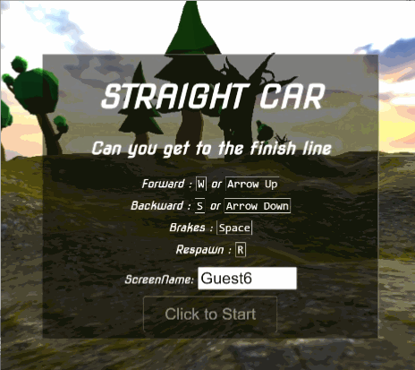

# Straight Car

You can only drive straight.

Play : [https://sc.sbcode.net](https://sc.sbcode.net)



### Desktop

-   Forward : <kbd>W</kbd> or <kbd>Arrow UP</kbd>
-   Backward : <kbd>S</kbd> or <kbd>Arrow Down</kbd>
-   Brakes : <kbd>Space</kbd>
-   Respawn : <kbd>R</kbd>

## Develop

1. Clone Repository

```bash
git clone https://github.com/Sean-Bradley/Straight-Car.git
```

2. CD into Folder

```bash
cd Straight-Car
```

3. Install TypeScript

```bash
npm install -g typescript
```

4. Install dependencies

```bash
npm install
```

5. Run

```bash
npm run dev
```

6. Open browser and visit http://127.0.0.1:8080

For more in depth information on production server deployment options, such as SSL, Domain name & Cloud hosting, visit [https://sbcode.net/threejs/nginx-host/](https://sbcode.net/threejs/nginx-host/)

## FAQs

### But, I want a car that can turn?

> The car in [Straight Car](https://sc.sbcode.net/), doesn't turn. Try instead https://github.com/Sean-Bradley/First-Car-Shooter

### Why is the game named "Straight Car"?

> Because the car can only drive straight. It is also a play on the term "street car".

### But it's too hard

> It's just a game to help you waste your time. Surely you have better things to put your energy into.

### I don't like something about it

> Read the [license](LICENSE). It is licensed MIT. That means that you get no warranties or guarantees of any kind. The repository is hosted on GitHub. That means that you can make a pull request if you really want to contribute an improvement.
